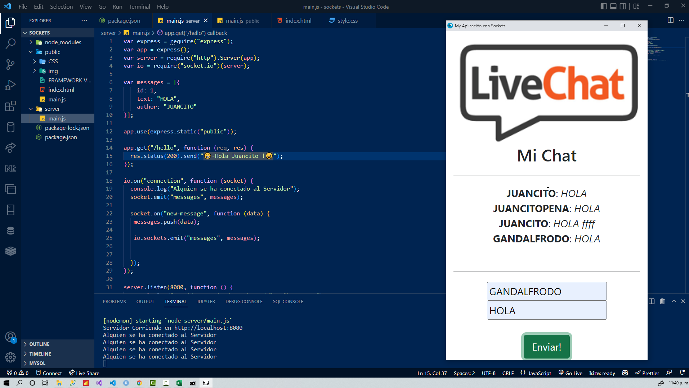
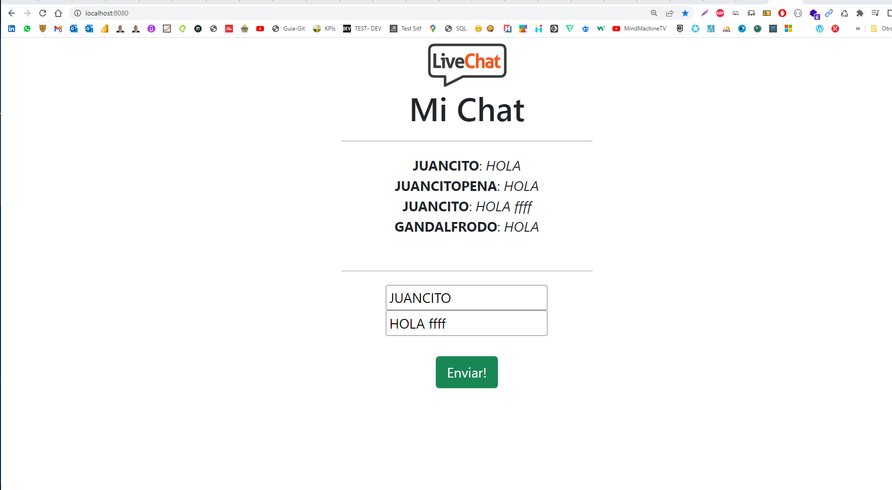

# Chat_Sockets
Chat_Sockets (HTML, CSS, JS, NodeJS, Express, Socket.io)

###  Comandos a Ejecutar en la Consola:
###  npm init -y
### npm install --save express
### npm install --save socket.io
### npm start

## CAPTURA DE PANTALLA # 1

## CAPTURA DE PANTALLA # 2

